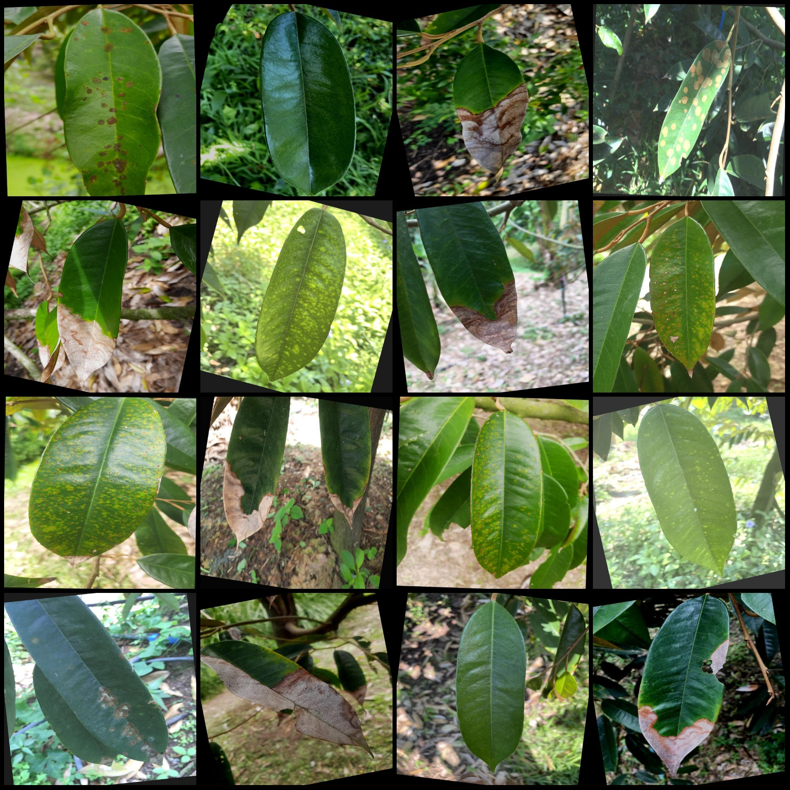
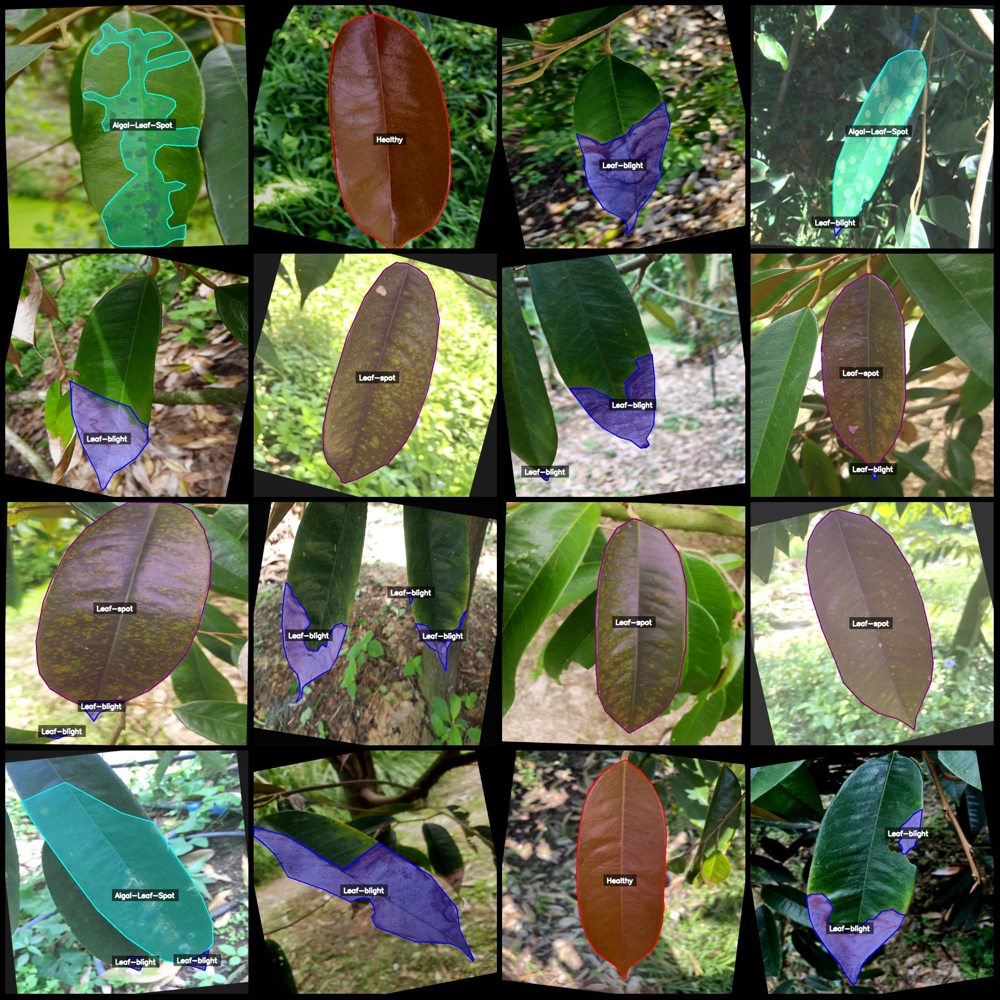
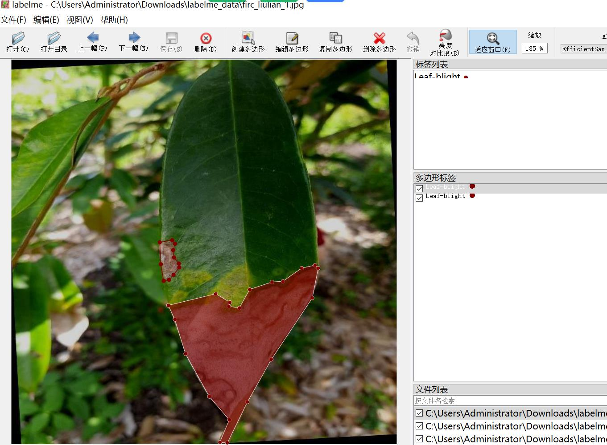

# Labeled Leaf Disease Identification and Segmentation Data Set in LabelMe Format

**418 Images, 4 Categories with Enhanced Rotations**

**Note:** The dataset contains a large number of rotated and enhanced images, over half of which are enhanced.

**Dataset Format:** LabelMe format (excluding mask files, only containing JPG images and corresponding JSON files)

**Number of Images (JPG Files):** 418

**Number of Annotations (JSON Files):** 418

**Number of Annotation Categories:** 4

**Annotation Category Names:** ["Algal-Leaf-Spot", "Healthy", "Leaf-blight", "Leaf-spot"]

**Number of Boxes per Category:**

- **Algal-Leaf-Spot (Algal Blight)** count = 137
- **Healthy (Healthy)** count = 100
- **Leaf-blight (Leaf Blight)** count = 446
- **Leaf-spot (Leaf Spot)** count = 128

**Total Number of Boxes:** 811

**Annotation Tool:** labelme=5.5.0

**Image Resolution:** 640x640

**Annotation Rules:** Draw polygon boxes around the categories.

**Important Notice:** You can open the dataset in LabelMe for editing. For JSON datasets, you need to convert them into either mask or YOLOF format or COCO format for semantic segmentation or 
instance segmentation.

**Special Disclaimer:** This dataset does not guarantee any accuracy in the trained models or weight files.

**Image Preview:**

**Annotated Examples:**

**Original Images (randomly selected 16):**

...

**Annotation Drawing Results:**

[Image](path_to_annotated_image_1.jpg)

[Image](path_to_annotated_image_2.jpg)

...

[Image](path_to_annotated_image_16.jpg)

## Images

Here is a pay link on Stripe ( https://buy.stripe.com/3cs8yP7sY87d0vu9AB ). Please contact me lonlonago@foxmail.com after funding $89, and I will send you a complete data files , thank you!

